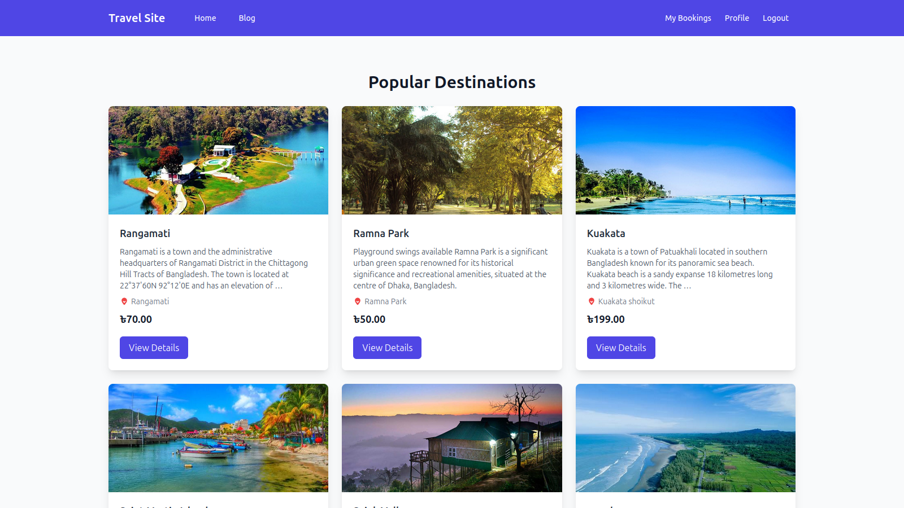
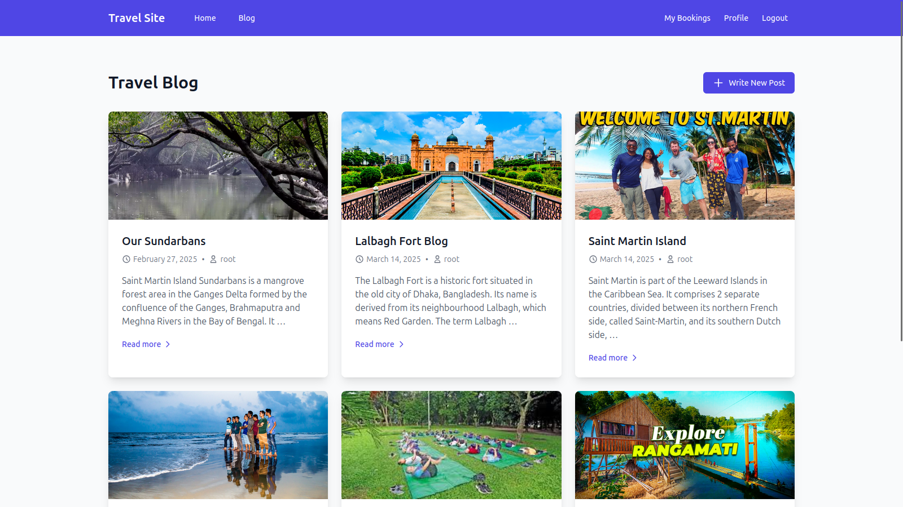
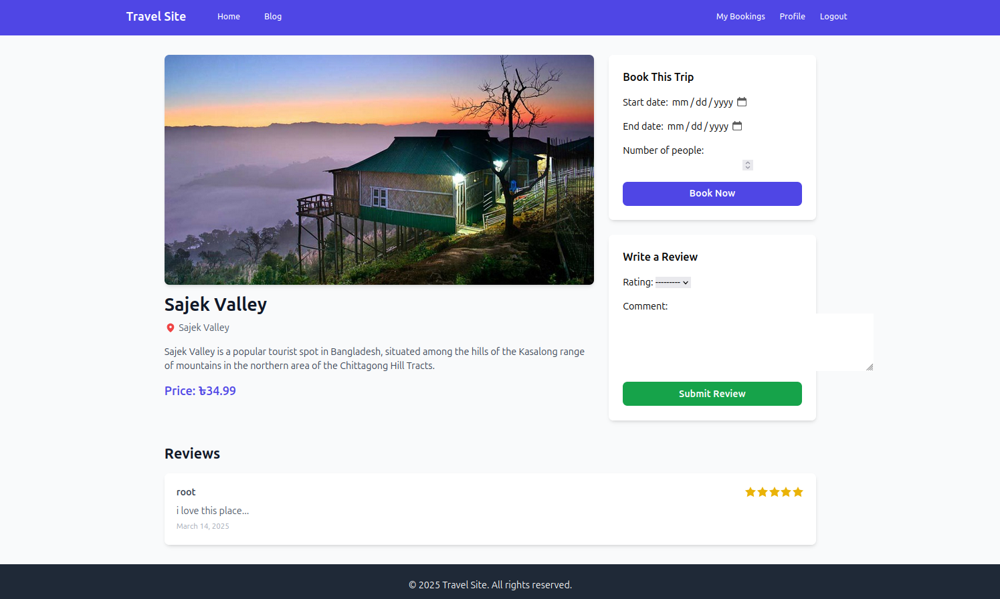

# 🌍 Travel Project ✈️

Travel Project is a **Django-based** web application designed to simplify planning your next trip. With this project, users can **discover destinations**, **create itineraries**, **book services**, and **share travel experiences**. 🏝️✨

---

## 🚀 Features

- 🌍 **Destination Discovery:** Explore detailed information, images, and descriptions of various travel destinations.
- 📍 **Itinerary Planning:** Design your travel route with an interactive itinerary planner.
- 🏨 **Booking Integration:** Seamlessly connect with booking services for hotels, flights, and more.
- 💬 **User Reviews:** Share your travel experiences and read reviews from other travelers.

---

## 🛠️ Technologies Used

- 🔹 **Backend:** Django (Python)
- 🎨 **Frontend:** HTML, CSS, JavaScript, Tailwind CSS 
- 🗄️ **Database:** SQLite (default) / PostgreSQL
<!-- - 🌐 **APIs:** Integration with travel-related APIs such as Google Maps API (if applicable)
- 🔗 **Other Libraries:** Django REST Framework (for API endpoints, if needed) -->

---

## 🏗️ Local Setup Instructions

1. **Clone the repository:** 📥
   ```bash
   git clone https://github.com/dhnraihan/travel-v2.git
   ```
2. **Navigate to the project directory:** 📂
   ```bash
   cd travel_project
   ```
3. **Create a virtual environment:** 🐍
   ```bash
   python -m venv venv
   ```
4. **Activate the virtual environment:** 🔄
   - On Windows:
     ```bash
     venv\Scripts\activate
     ```
   - On macOS/Linux:
     ```bash
     source venv/bin/activate
     ```
5. **Install dependencies:** 📦
   ```bash
   pip install -r requirements.txt
   ```
6. **Apply migrations:** 🔄
   ```bash
   python manage.py migrate
   ```
7. **Create a superuser (optional but recommended for admin access):** 🔑
   ```bash
   python manage.py createsuperuser
   ```
8. **Run the development server:** 🚀
   ```bash
   python manage.py runserver
   ```
   The application will be available at **[http://127.0.0.1:8000](http://127.0.0.1:8000)**. 🌐

---
## Screenshots 📸

### Home Page


### Booking Page


### Itinerary Page


---


## 🤝 Contributing

We welcome contributions! 🛠️ If you'd like to add new features or fix bugs, please follow these steps:
1. **Fork the repository.** 🍴
2. **Create a new branch:** 🌿
   ```bash
   git checkout -b feature/your-feature-name
   ```
3. **Commit your changes:** 📝
   ```bash
   git commit -am "Add new feature or fix bug"
   ```
4. **Push the branch:** 📤
   ```bash
   git push origin feature/your-feature-name
   ```
5. **Open a Pull Request.** 🔄

---

## 📜 License

This project is licensed under the **MIT License** – see the [LICENSE](LICENSE) file for details. 📄